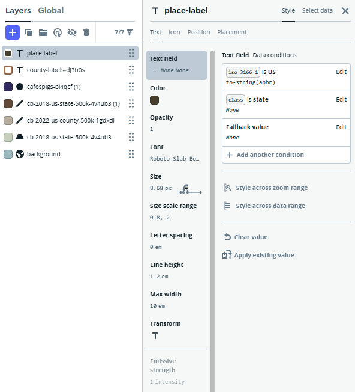

# Hog Farms in Sampson and Duplin County, North Carolina

The following map illustrates the number of hog, or pig, farms across the United States. Over the past century, hog farming has expanded dramatically nationwide as pork production has become a major component of the U.S. meat industry. This interactive map allows viewers to zoom in on individual states and counties to examine the concentration of CAFO (Concentrated Animal Feeding Operation) hog farms in specific regions. The visualization highlights how this growth is unevenly distributed across the country, with some states experiencing far more rapid expansion than others. One state that has seen a particularly significant increase is North Carolina, specifically Sampson and Duplin County!

## How the create the map:

### Step 1: Download data.
* CAFO Pigs data from FigShare: <a href="https://figshare.com/articles/dataset/Size_and_location_of_AFOs_across_the_U_S_/29511140?file=56080049">CAFO Data</a>
* State data from Census.gov: <a href="https://www.census.gov/geographies/mapping-files/time-series/geo/carto-boundary-file.html">State Census Data</a>
* County data from USDA.gov: <a href="https://www.ers.usda.gov/data-products/county-level-data-sets/county-level-data-sets-download-data">County USDA Data</a>

### Step 2: Save each downloaded zip file into a folder labeled "final-project".

### Step 3: Add zipped files into MapBox as datasets.

### Step 4: Add the tiles and make the edits shown in the screenshots.
Add a blue background so the U.S. stands out on the map.

 

Make two copies of the counties file. One will be used for borders and the second will be used to label each U.S. county.

 

 

Finally, add in a place-label and make the following edits with a white halo. Make the halo's width 2px to make the state name clearly visible.

### Your map should look like the following when zoomed in:

Note, the initial and final projection of the map is Web Mercator (EPSG:3857).

#### Link to final index: <a href="http://127.0.0.1:5500/index.html">Index</a> and index html file: <a href="https://github.com/shivanipatela/final-project-map671/blob/main/index.html">Index HTML File</a>

