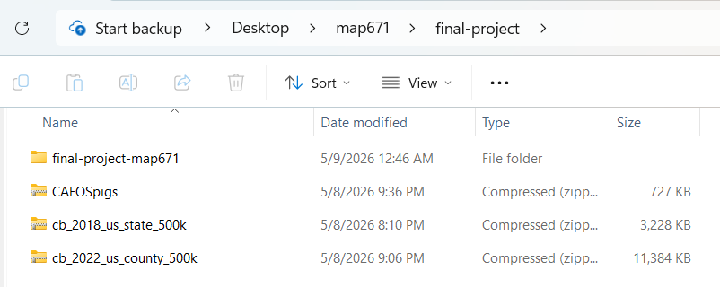
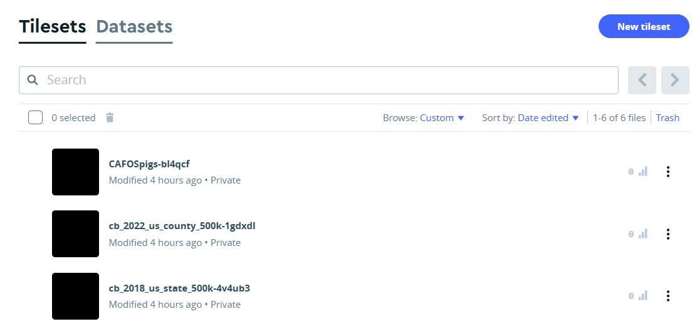
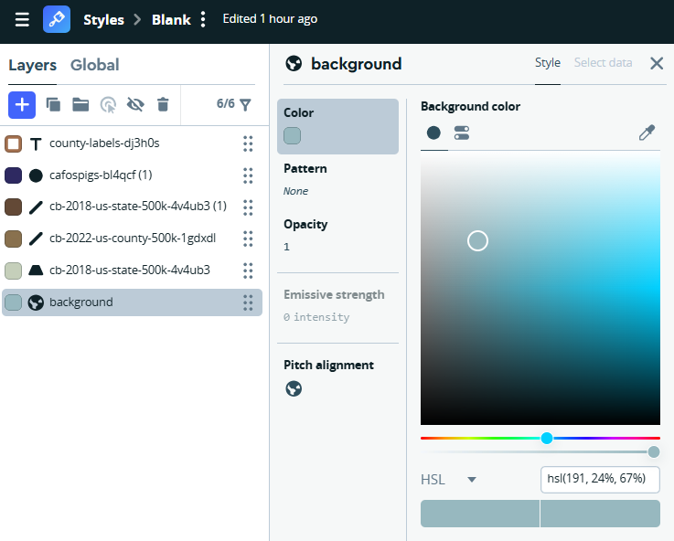
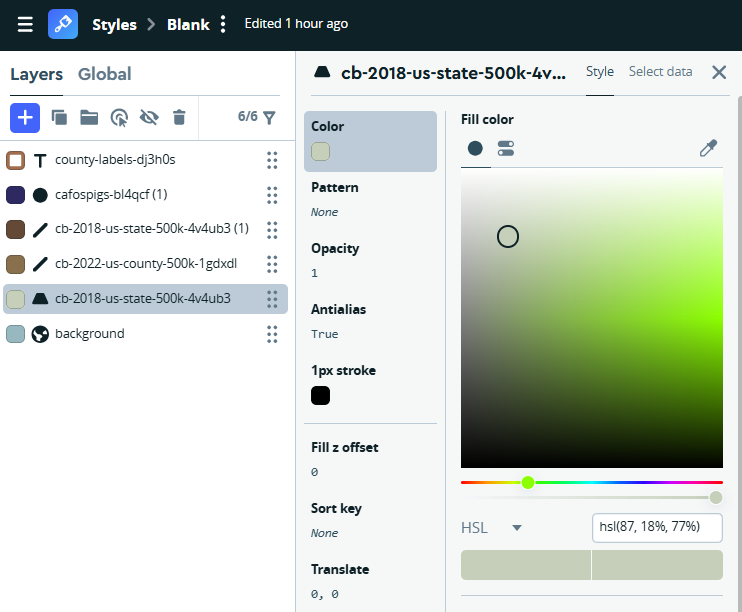
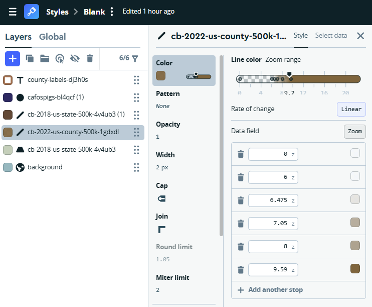
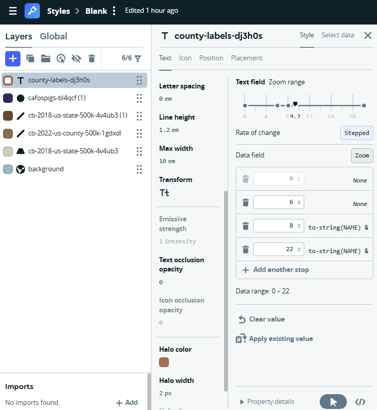
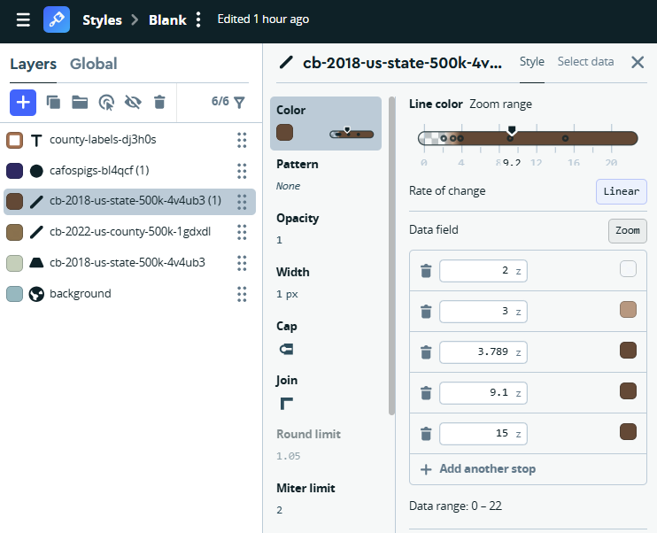
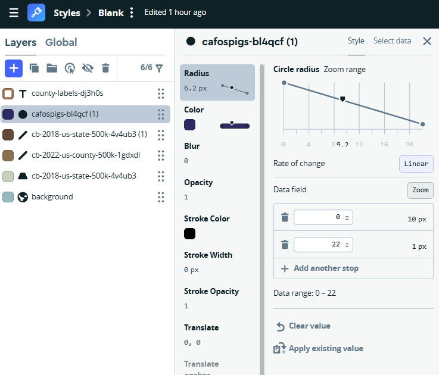
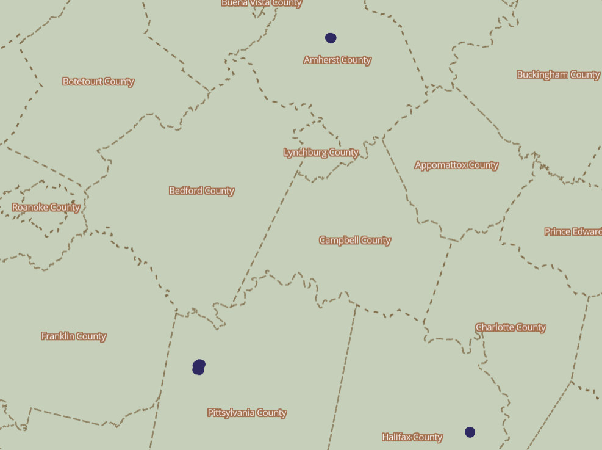

# Map of Hog Farms in the United States

The following map illustrates the number of hog, or pig, farms across the United States. Over the past century, hog farming has expanded dramatically nationwide as pork production has become a major component of the U.S. meat industry. This interactive map allows viewers to zoom in on individual states and counties to examine the concentration of CAFO (Concentrated Animal Feeding Operation) hog farms in specific regions. The visualization highlights how this growth is unevenly distributed across the country, with some states experiencing far more rapid expansion than others. One state that has seen a particularly significant increase is North Carolina, specifically Sampson and Duplin County!

## How the create the map:

### Step 1: Download data.
* CAFO Pigs data from FigShare: <a href="https://figshare.com/articles/dataset/Size_and_location_of_AFOs_across_the_U_S_/29511140?file=56080049">CAFO Data</a>
* State data from Census.gov: <a href="https://www.census.gov/geographies/mapping-files/time-series/geo/carto-boundary-file.html">State Census Data</a>
* County data from USDA.gov: <a href="https://www.ers.usda.gov/data-products/county-level-data-sets/county-level-data-sets-download-data">County USDA Data</a>

### Step 2: Save each downloaded zip file into a folder labeled "final-project".

### Step 3: Add zipped files into MapBox as datasets.

### Step 4: Add the tiles and make the edits shown in the screenshots.
Add a blue background so the U.S. stands out on the map.

 

Make two copies of the counties file. One will be used for borders and the second will be used to label each U.S. county.

 

 

Your map should look like the following when zoomed in:

## Final project components

The final project is worth 500 points. The points are assigned as follows.

### Project Setup (50 points)

* Create a repository (10 points)
* Add the instructor as a collaborator (10 points)
    * Instructor GitHub username jfobrycki
* Add a license to the repository (10 points)
* Project files should be organized in folders as needed to demonstrate attention to data management (20 points)

### Project Description (130 points)

The README.md file should provide sufficient detail on the project and include the following components.

* Project title (10 points)
* Information about data source (10 points) 
* Link to the data source, if applicable, or a copy of the full data source for download (10 points)
* Markdown formatting throughout the document (10 points)
* Description about why you created the map (10 points)
* Description about how the map was created, including any geoprocessing methods or other steps you took described in a way that someone else could try to recreate your map process in a new location (30 points)
* Active link to the final index.html page (20 points)
* Include embedded images, as needed, to document the mapping process, including key data management or geoprocessing steps and settings (20 points)
* Information about the projection of the original data and the projection for the final data (10 points)

### Project Map (130 points)

And here's the map! The map should contain the following elements.

* Map displays a location (10 points)

* Map contains an item(s) that is the focus of the map's objective (10 points)

* Map includes a detailed legend to allow the viewer to interpret what is being shown on the map (30 points)

* Map includes metadata sufficient for the viewer to interpret the map initially, including author, projection, scale, directional arrow, and software used (30 points)

* Map uses a color scheme suitable for the data type (20 points)

* Map is available in two resolutions, either two exported static maps at two dpi levels or an interactive map available at small and full screen versions (15 points)

* Map presentation (15 points), including font sizes that can be viewed from the smaller resolution map, and map is free from numerous spelling or grammar errors

### Project Website (130 points)

* Index.html file loads and displays the map with no broken links (30 points)

* The index.html file includes a working link back to your GitHub repository (20 points)

* Link is included for a higher resolution image or the full screen interactive map (20 points)

* Index.html includes title, header, and other html formatting (10 points)

* Index.html includes initial metadata such that the viewer to interpret the map (20 points)

* Page presentation includes appropriate font sizes, font and background colors, to be accessible (10 points)

* Index.html file does not include any extra visible code due to formatting and coding issues (20 points)

### Project Discussion (60 points)

Create a post to the final project map gallery

* Include a link to your repository (if a public repository) or several screenshots of your readme.md, index.html file, and map (if a private repository) (10 points)

* Provide a short description of why you created the map (10 points)

* Provide an answer to the question: what went well with the final project? (15 points)

* Provide an answer to the question: what would you like to try differently on future maps? (15 points)

* View and comment on at least 1 other final project post from the class (10 points)
